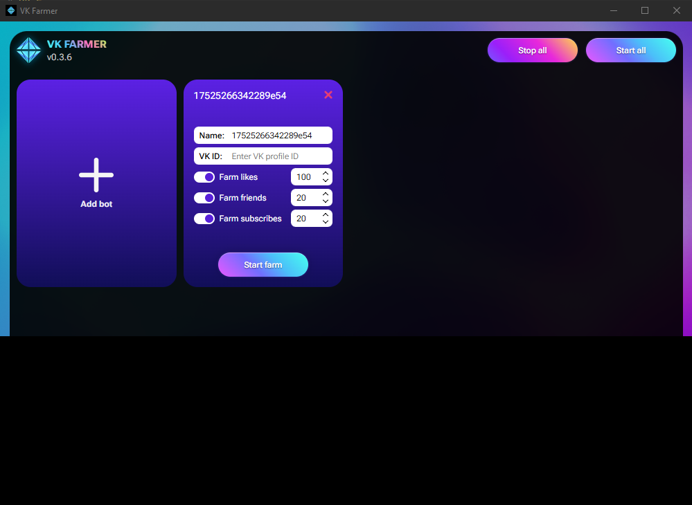

# VK Farmer

VK Farmer is a convenient bot manager for automatically earning points on popular sites like Freelikes and Biglike. Just start the program and go about your day — play games, work, or relax. The program will automatically complete tasks and accumulate points that you can use to promote your social media accounts.

> **Download 'VK Farmer' for Windows**: [Release v0.3.6](https://github.com/fuderis/vk-farmer/raw/main/VKFarmer.zip)

## Features:

* **Automatic points earning** on Freelikes and Biglike websites
* **Easy to use**: just launch the program and let it run in the background
* **Invisible operation**: you can freely use your computer and play games without any slowdowns
* **Time-saving**: no need to complete tasks manually, the program does everything for you
* **Points for promotion**: accumulated points can be spent on boosting your social media accounts

## Installation:

1. Download and install the [latest version](https://github.com/fuderis/vk-farmer/raw/main/VKFarmer.zip).
2. Set up bot profiles and launch them one by one, logging into each bot's VKontakte account.
3. Start the bots and minimize the program window so it moves to the system tray.
4. Let it run in the background while you go about your activities.
5. Use the earned points to promote your social networks.

## Requirements:

* **Operating System**: Windows 10/11 (64 bit)
* **Internet connection**: stable and with high speed

## Feedback:

You can find me [here](https://t.me/fuderis), also see my [channel](https://t.me/fuderis_club).
I welcome your suggestions and feedback!

> Copyright (c) 2025 *Bulat Sh.* ([fuderis](https://t.me/fuderis))
