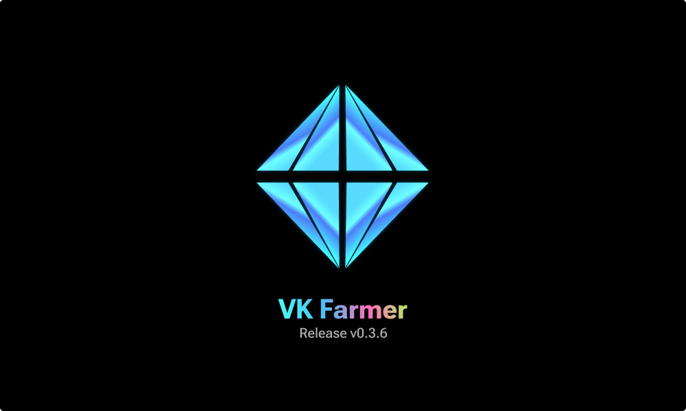
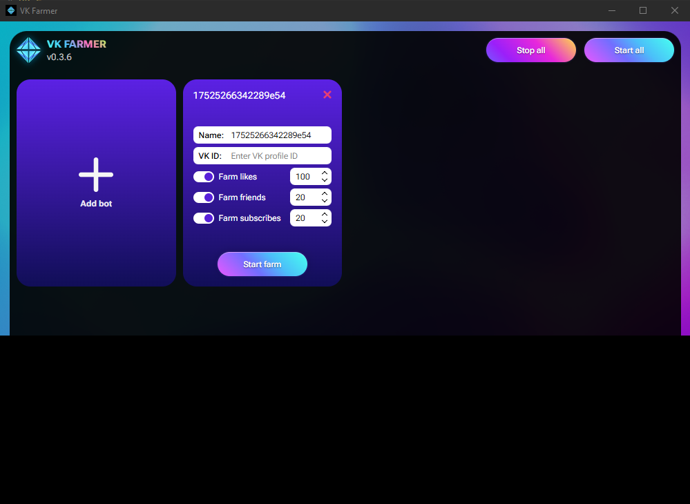

# VK Farmer

VK Farmer — это удобный менеджер ботов для автоматического заработка баллов на популярных сайтах, таких как Freelikes и Biglike. Просто включите программу и занимайтесь своими делами — играйте в игры, работайте или отдыхайте. Программа будет автоматически выполнять задачи и накапливать баллы, которые вы сможете использовать для продвижения своих социальных сетей.

> **Скачать 'VK Farmer' для Windows**: [Release v0.3.6](https://github.com/fuderis/vk-farmer/raw/main/VKFarmer.zip)

## Возможности:

* **Автоматический заработок баллов** на сайтах Freelikes и Biglike
* **Простота использования**: достаточно запустить программу и оставить её работать в фоне
* **Незаметная работа**: можно спокойно пользоваться компьютером и играть в игры без тормозов
* **Экономия времени**: не нужно вручную выполнять задания, программа сделает всё сама
* **Баллы для раскрутки**: накопленные баллы можно тратить на продвижение своих аккаунтов в соцсетях

## Установка:

1. Скачайте и установите [последнюю версию](https://github.com/fuderis/vk-farmer/raw/main/VKFarmer.zip).
2. Установите браузер **Google Chrome** и обновите его до последней версии.
3. Настройте профили ботов и запускайте их по очереди, авторизовываясь в аккаунте бота в ВКонтакте.
4. Запустите ботов и сверните окно программы, чтобы она ушла в системный трей.
5. Оставьте её работать в фоне и занимайтесь своими делами.
6. Используйте баллы для раскрутки своих социальных сетей.

## Требования:

* **Операционная система**: Windows 10/11 (64 bit)
* **Интернет-соединение**: стабильное и с высокой скоростью

## Обратная связь:

Связаться со мной можно [здесь](https://t.me/fuderis), а также загляните на мой [канал](https://t.me/fuderis_club).
Буду рад вашим предложениям и отзывам!

> Copyright (c) 2025 *Bulat Sh.* ([fuderis](https://t.me/fuderis))
